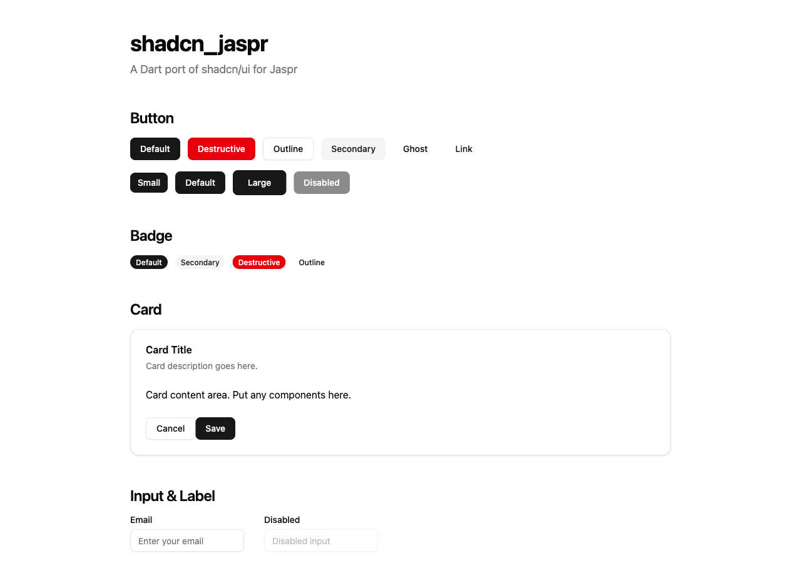
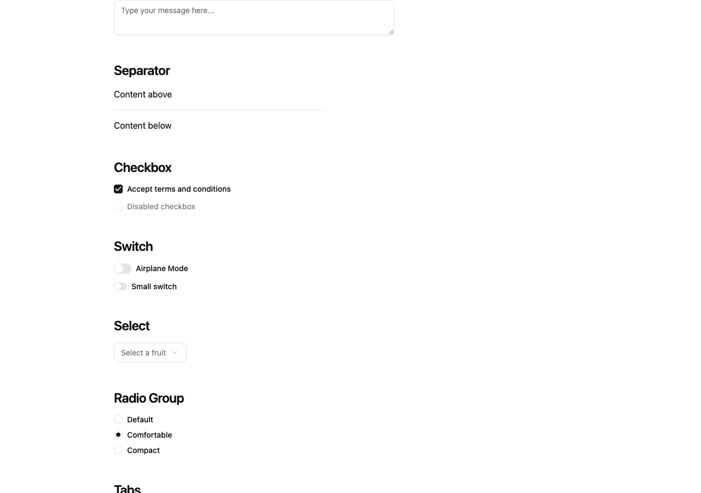
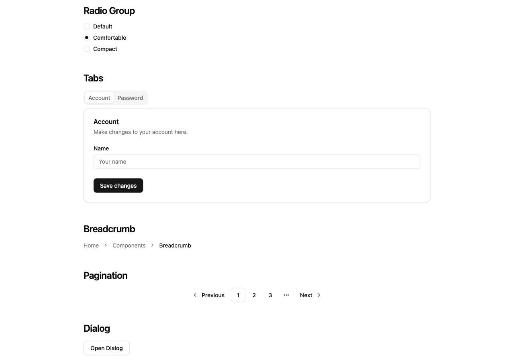
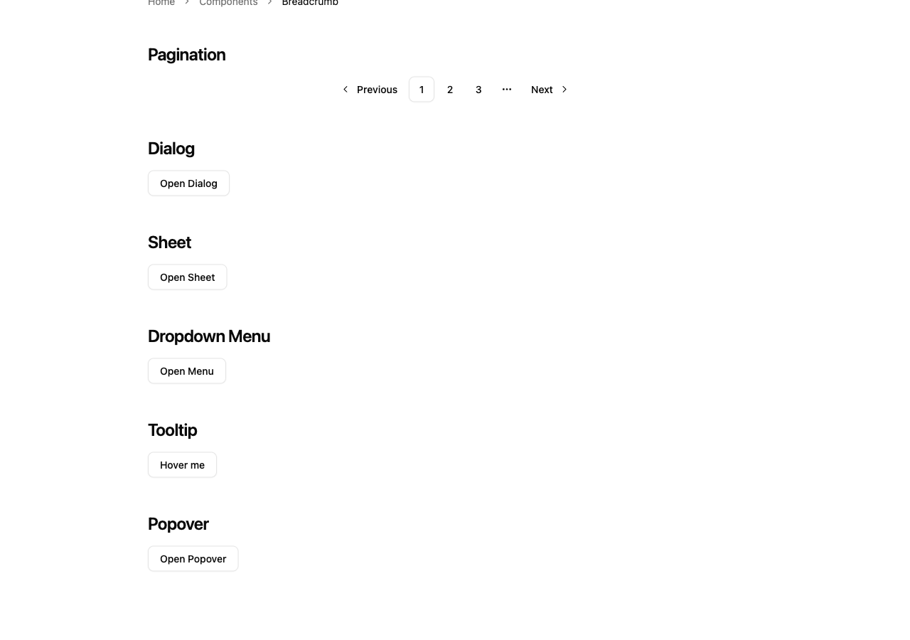
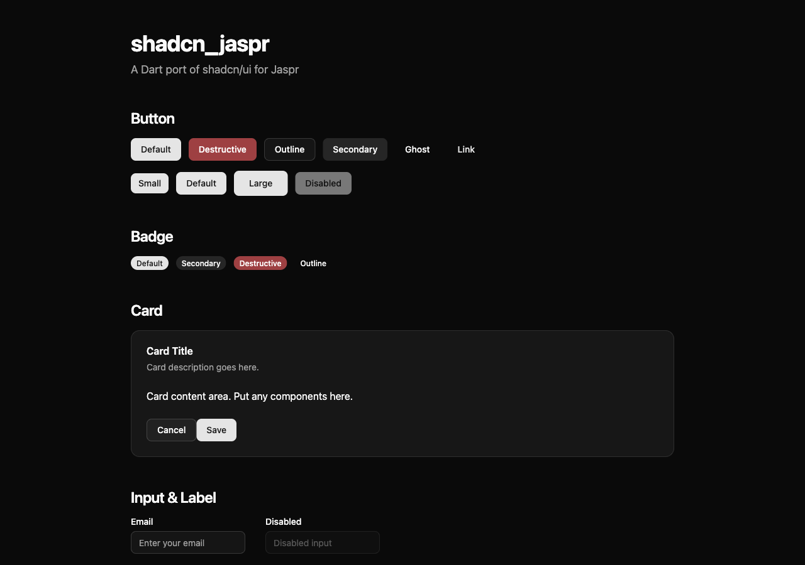

# shadcn_jaspr

A Dart port of [shadcn/ui](https://ui.shadcn.com/) for the [Jaspr](https://jasprpad.schultek.de/) web framework.

Beautiful, accessible, and customizable UI components built with Tailwind CSS — now available for Dart web apps.

[](https://pub.dev/packages/shadcn_jaspr)
[](https://opensource.org/licenses/MIT)

## Screenshots

### Light Mode









### Dark Mode



## Components

### Base
- **Button** — 6 variants (default, destructive, outline, secondary, ghost, link) and 8 sizes
- **Badge** — 4 variants (default, secondary, destructive, outline)
- **Card** — With Header, Title, Description, Content, and Footer sub-components
- **Input** — Text input with placeholder, disabled state, and file input support
- **Label** — Accessible label with `htmlFor` binding
- **Separator** — Horizontal and vertical dividers

### Form
- **Checkbox** — Controlled checkbox with checked/disabled states
- **Switch** — Toggle switch with default and small sizes
- **Textarea** — Auto-resizing text area
- **Select** — Custom dropdown select with items and separators
- **RadioGroup** — Radio button group with scoped state

### Navigation
- **Tabs** — Tab panels with default and line variants
- **Breadcrumb** — Navigation breadcrumbs with separators
- **Pagination** — Page navigation with previous/next and ellipsis

### Overlay
- **Dialog** — Modal dialog with header, footer, and close button
- **Sheet** — Slide-in panel from any side (top, right, bottom, left)
- **DropdownMenu** — Context menu with items, labels, and separators
- **Tooltip** — Hover/focus tooltip with configurable side and delay
- **Popover** — Click-triggered popover with content

## Getting Started

### 1. Add the dependency

```yaml
dependencies:
  shadcn_jaspr: ^0.1.0
```

### 2. Set up Tailwind CSS

Copy the theme CSS file from `package:shadcn_jaspr/web/styles/globals.tw.css` to your project's `web/styles/` directory. This file defines CSS custom properties for the color theme (light and dark mode).

Your `globals.tw.css`:
```css
@import "tailwindcss";
@import "tw-animate-css";

@custom-variant dark (&:is(.dark *));

@theme inline {
  /* ... color tokens, border-radius tokens ... */
}

@layer base {
  * {
    @apply border-border;
  }
  body {
    @apply bg-background text-foreground;
  }
}
```

### 3. Import and use components

```dart
import 'package:jaspr/jaspr.dart';
import 'package:shadcn_jaspr/shadcn_jaspr.dart';

class MyPage extends StatelessComponent {
  @override
  Iterable<Component> build(BuildContext context) sync* {
    yield ShadButton(
      [text('Click me')],
      variant: ButtonVariant.destructive,
      onPressed: () => print('Clicked!'),
    );
  }
}
```

## Usage Examples

### Button

```dart
ShadButton([text('Default')])
ShadButton([text('Destructive')], variant: ButtonVariant.destructive)
ShadButton([text('Outline')], variant: ButtonVariant.outline)
ShadButton([text('Small')], size: ButtonSize.sm)
ShadButton([text('Disabled')], isDisabled: true)
```

### Card

```dart
ShadCard([
  ShadCardHeader([
    ShadCardTitle([text('Card Title')]),
    ShadCardDescription([text('Card description.')]),
  ]),
  ShadCardContent([
    p([text('Card content area.')]),
  ]),
  ShadCardFooter([
    ShadButton([text('Cancel')], variant: ButtonVariant.outline),
    ShadButton([text('Save')]),
  ]),
])
```

### Dialog

```dart
ShadDialog(children: [
  ShadDialogTrigger([
    ShadButton([text('Open Dialog')], variant: ButtonVariant.outline),
  ]),
  ShadDialogContent([
    ShadDialogHeader([
      ShadDialogTitle([text('Are you sure?')]),
      ShadDialogDescription([text('This action cannot be undone.')]),
    ]),
    ShadDialogFooter([
      ShadButton([text('Cancel')], variant: ButtonVariant.outline),
      ShadButton([text('Continue')]),
    ]),
  ]),
])
```

### Tabs

```dart
ShadTabs(
  defaultValue: 'account',
  children: [
    ShadTabsList([
      ShadTabsTrigger(value: 'account', children: [text('Account')]),
      ShadTabsTrigger(value: 'password', children: [text('Password')]),
    ]),
    ShadTabsContent(value: 'account', children: [text('Account tab')]),
    ShadTabsContent(value: 'password', children: [text('Password tab')]),
  ],
)
```

## Dark Mode

Toggle dark mode by adding/removing the `dark` class on the `<html>` element:

```dart
document.documentElement?.classList.toggle('dark');
```

## Utilities

### `cn()` — Class Name Merging

```dart
cn(['flex', 'items-center', null, '', 'gap-2'])
// => 'flex items-center gap-2'
```

### `CVA` — Class Variance Authority

Manage component variant styles with type-safe enums:

```dart
final buttonCva = CVA<ButtonVariant, ButtonSize>(
  base: 'inline-flex items-center justify-center rounded-md',
  variants: { ButtonVariant.destructive: 'bg-destructive text-white' },
  sizes: { ButtonSize.sm: 'h-8 px-3 text-xs' },
);

final classes = buttonCva.resolve(
  variant: ButtonVariant.destructive,
  size: ButtonSize.sm,
);
```

## Requirements

- Dart SDK `^3.6.0`
- Jaspr `^0.19.0`
- Tailwind CSS (for styling)

## Contributing

Contributions are welcome! Please feel free to submit a Pull Request.

## License

MIT License. See [LICENSE](LICENSE) for details.

## Acknowledgments

- [shadcn/ui](https://ui.shadcn.com/) — The original React component library
- [Jaspr](https://github.com/schultek/jaspr) — Dart web framework
- [Tailwind CSS](https://tailwindcss.com/) — Utility-first CSS framework
